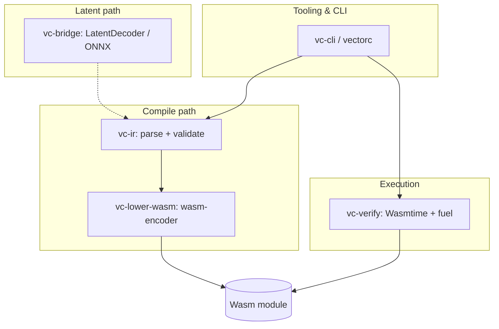

# VectorCompiler

<!-- Badges (replace placeholders when publishing):
[](.)
[](rust-toolchain.toml)
[](LICENSE)
-->

**VectorCompiler** is a research-oriented pipeline for turning **latent representations** into **executable programs**: continuous vectors → a verifiable **Program IR** → **WebAssembly** modules you can run under strict, deterministic limits.

- **Today:** latent JSON (`decode-z` via `vc-bridge`), Program IR as `.vcir`, validate → Wasm → Wasmtime with fuel; **`vectorc digest` / `inspect` / `compile --print-digest`** for artifact pinning ([trust model](docs/TRUST_AND_CANONICAL_ARTIFACTS.md)); strict Wasm preflight; optional **`--features onnx`** loads ONNX (`OrtLatentDecoder`) with frozen **`z`** + **`program_ir_json`** contract (see [DECODER_ROADMAP.md](docs/DECODER_ROADMAP.md)).
- **Training oracle:** [`vectorc eval`](docs/VECTORBENCH_V0.md) scores `.vcir` against [VectorBench v0](benchmarks/vectorbench_v0/suite.json) (`execute_rate`, `validate_rate`, …).
- **Next:** trained decoder weights and dataset-scale eval beyond checked-in fixtures ([LATENT_FIRST_TRAINING_PLAN.md](docs/LATENT_FIRST_TRAINING_PLAN.md)).

📖 **Detailed documentation:** [docs/](docs/)

---

## Vision: latent → IR → Wasm

High-dimensional signals (embeddings, generative latents, learned codecs) are not directly executable. VectorCompiler treats **Program IR v2** as the stable, human-auditable midpoint: a small Wasm-aligned stack machine with structured control (`block` / `if_else`). From there, lowering to Wasm gives you a **portable artifact** that runs the same logic across hosts and can be bounded by engine-level limits instead of trusting native code generation on every platform.


---

## Repository layout (high level)

| Crate | Role | README |
|-------|------|--------|
| `vc-ir` | Program IR AST, JSON parse, static validation | [crates/vc-ir/README.md](crates/vc-ir/README.md) |
| `vc-lower-wasm` | IR → Wasm (`wasm-encoder`) | [crates/vc-lower-wasm/README.md](crates/vc-lower-wasm/README.md) |
| `vc-verify` | Sandboxed Wasmtime invoke (fuel + policy) | [crates/vc-verify/README.md](crates/vc-verify/README.md) |
| `vc-refine` | Verifier-driven IR search (`RandomIrRefiner`) | [crates/vc-refine/README.md](crates/vc-refine/README.md) |
| `vc-bridge` | `LatentDecoder`; golden; optional ONNX | [crates/vc-bridge/README.md](crates/vc-bridge/README.md) |
| `vc-cli` | `vectorc` — decode-z, compile, eval, run, … | [crates/vc-cli/README.md](crates/vc-cli/README.md) |

See [docs/ARCHITECTURE.md](docs/ARCHITECTURE.md) for boundaries and extension points.

---

## Requirements

- **Rust toolchain:** `1.91.0` (see [`rust-toolchain.toml`](rust-toolchain.toml))

**Disk hygiene:** debug builds are large (~1 GiB `target/` is normal). Use `./scripts/target-size.sh` and `./scripts/clean.sh` (wraps built-in `cargo clean`) — see [docs/DEVELOPMENT.md](docs/DEVELOPMENT.md).

---

## Quickstart

From the repository root:

### Latent vector → Program IR (optional Wasm)

`decode-z` reads a JSON file that is either a bare `[f32, …]` or `{"z":[…]}`. Length must match [`EMBEDDING_DIM`](crates/vc-bridge/src/decoder.rs) (**256** today).

- **`--decoder stub`** (default): fails until a learned decoder is wired.
- **`--decoder golden`**: emits deterministic add-two-i32 IR for pipeline tests (see `benchmarks/fixtures/z_zeros.json`).
- **`--features onnx`** on `vc-cli`: adds **`--decoder onnx`** and **`--onnx-model`**; ONNX loads, validates **`z`** + **`program_ir_json`**, runs inference, parses embedded Program IR JSON (checked-in fixture matches golden add IR).

```bash
cargo run -p vc-cli -- decode-z \
  -z benchmarks/fixtures/z_zeros.json \
  -o /tmp/from_z.vcir \
  --wasm-out /tmp/from_z.wasm \
  --decoder golden

cargo run -p vc-cli -- run -i /tmp/from_z.wasm -e run -f 100000 -a 40,2 --expect 42
```

### Compile Program IR → Wasm

```bash
cargo run -p vc-cli -- compile \
  -i benchmarks/programs/add.vcir \
  -o /tmp/add.wasm
```

Fingerprint emitted Wasm (SHA-256 hex), pin tooling reproducibility ([docs/TRUST_AND_CANONICAL_ARTIFACTS.md](docs/TRUST_AND_CANONICAL_ARTIFACTS.md)):

```bash
cargo run -p vc-cli -- compile \
  -i benchmarks/programs/add.vcir \
  -o /tmp/add.wasm \
  --print-digest
```

Other bounded-file tooling:

```bash
cargo run -p vc-cli -- digest -i benchmarks/programs/add.vcir
cargo run -p vc-cli -- inspect -i benchmarks/programs/add.vcir
```

### Run a Wasm module (fuel-limited, single `i32` return)

```bash
cargo run -p vc-cli -- run \
  -i /tmp/add.wasm \
  -e run \
  -f 100000 \
  -a 40,2
```

Optional: fail the process if the result is not as expected:

```bash
cargo run -p vc-cli -- run -i /tmp/add.wasm -e run -f 100000 -a 40,2 --expect 42
```

### Bench: manifest-driven compile + many cases

`bench` reads a JSON manifest, compiles the referenced `.vcir` in-process, and checks each case with the same fuel budget.

```bash
cargo run -p vc-cli -- bench -m benchmarks/manifests/add.json
```

### Benchmark manifest example

Manifests use `schema_version: 1`. **`program_path` is relative to the `benchmarks/` directory** (the parent directory of `manifests/`), must not contain `..`, and is canonicalized so it cannot escape outside `benchmarks/`.

Example:

```json
{
  "schema_version": 1,
  "program_path": "programs/add.vcir",
  "export": "run",
  "fuel": 100000,
  "cases": [
    { "args": [1, 2], "expect_i32": 3 },
    { "args": [40, 2], "expect_i32": 42 },
    { "args": [-1, 1], "expect_i32": 0 }
  ]
}
```

Sample programs live under [`benchmarks/programs/`](benchmarks/programs/).

### Synthesize: search for IR that matches a behavioral spec

`synthesize` runs random mutations over Program IR and keeps candidates that pass `validate_module` and satisfy every case in a spec (via Wasm execution). This is a **heuristic baseline**, not a trained latent decoder.

```bash
cargo run -p vc-cli -- synthesize \
  --spec benchmarks/manifests/add.json \
  --steps 500 \
  --refiner-seed 0 \
  -o /tmp/synthesized.vcir
```

- **`--spec`**: JSON with a `cases` array (see [`schemas/bench_spec_v1.schema.json`](schemas/bench_spec_v1.schema.json)). Full bench manifests also work at runtime; fields like `program_path` and `fuel` are ignored except `cases`.
- **`--seed`**: optional initial `.vcir`; default is `benchmarks/programs/add.vcir` or a built-in add template.
- **`--refiner-seed`**: RNG for the refiner (separate from any future IR seeding).

---

## Architecture (diagram)



---

## Security

Executing **any** Wasm (including modules produced here) is a trust and resource-boundary problem. VectorCompiler defaults to **minimal host surface** (no WASI, no imported functions in emitted modules). See [docs/SECURITY.md](docs/SECURITY.md) and the adversarial pass in [docs/ADVERSARIAL_AUDIT.md](docs/ADVERSARIAL_AUDIT.md).

---

## Documentation index

| Document | Contents |
|----------|----------|
| [docs/ARCHITECTURE.md](docs/ARCHITECTURE.md) | Crates, boundaries, trait extension points, Wasm-first rationale |
| [docs/TARGETS.md](docs/TARGETS.md) | Apple Silicon, Intel macOS, RISC-V Linux, Wasm portability |
| [docs/SECURITY.md](docs/SECURITY.md) | Threat model, fuel, WASI posture, supply chain |
| [docs/ADVERSARIAL_AUDIT.md](docs/ADVERSARIAL_AUDIT.md) | Abuse cases, mitigations, residual risk |
| [docs/FULL_LINE_AUDIT.md](docs/FULL_LINE_AUDIT.md) | Line-by-line adversarial read of all Rust sources |
| [docs/DECODER_ROADMAP.md](docs/DECODER_ROADMAP.md) | Latent → IR / ONNX integration outline (`vc-bridge`) |
| [docs/Z_CONTRACT.md](docs/Z_CONTRACT.md) | Frozen expectations for latent vector `z` (length, dtype, JSON envelope) |
| [docs/Z_BUILD.md](docs/Z_BUILD.md) | v0 deterministic `program_id` → `z` recipe (must match `gen_training_rows.py`) |
| [docs/TRAINING_DATA.md](docs/TRAINING_DATA.md) | Training shard layout (`rows.jsonl`, splits, manifests, oracle wiring) |
| [docs/DEBUGGING_DECODE.md](docs/DEBUGGING_DECODE.md) | Failure dumps when `execute_rate` stalls |
| [docs/IR_VERSIONING.md](docs/IR_VERSIONING.md) | Program IR version pins, schemas, bump checklist |
| [docs/TRUST_AND_CANONICAL_ARTIFACTS.md](docs/TRUST_AND_CANONICAL_ARTIFACTS.md) | Authority boundaries, `digest` / `inspect`, dataset manifests |
| [docs/LATENT_FIRST_TRAINING_PLAN.md](docs/LATENT_FIRST_TRAINING_PLAN.md) | End-to-end plan: contracts, data, training, ONNX, eval, agent workstreams |
| [docs/TRAINING_ON_MAC.md](docs/TRAINING_ON_MAC.md) | Economical `z`→IR decoder training (MacBook Air + optional cloud GPU) |
| [docs/PREFLIGHT_BEFORE_TRAINING.md](docs/PREFLIGHT_BEFORE_TRAINING.md) | Gate: correctness checklist + what to optimize before training |
| [docs/VECTORBENCH_V0.md](docs/VECTORBENCH_V0.md) | Frozen benchmark suite + `vectorc eval` metrics for training |
| [docs/CONDITIONS_FOR_OBSOLESCENCE.md](docs/CONDITIONS_FOR_OBSOLESCENCE.md) | Theory: what “beyond source code” requires, paths, scope honesty vs v1 |
| [docs/DEVELOPMENT.md](docs/DEVELOPMENT.md) | Toolchain, `cargo clean`, scripts, standard checks |
| [docs/VETTING_REPORT.md](docs/VETTING_REPORT.md) | Full-repo audit summary and open risks |
| [schemas/](schemas/) | JSON Schema for Program IR v2, bench specs, dataset manifests |

---

## License

Licensed under the terms in the workspace `Cargo.toml` (MIT OR Apache-2.0).
