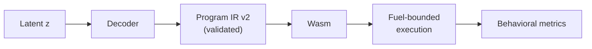
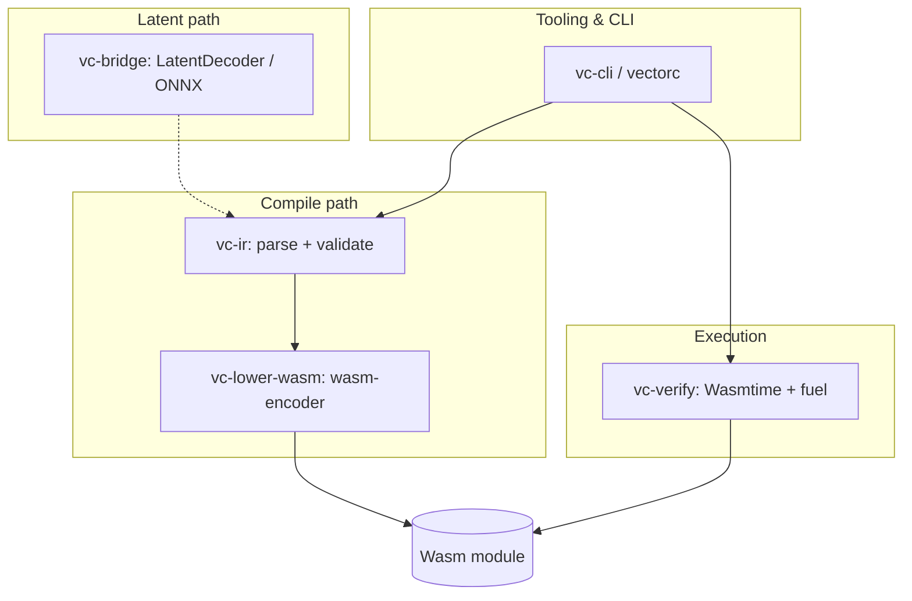

# VectorCompiler

[](https://github.com/Alphabetsoup16/VectorComplier/actions/workflows/ci.yml)
[](rust-toolchain.toml)
[](LICENSE)

## Why this matters

Modern ML systems—agents, multimodal models, retrieval stacks—do most of their reasoning in **high-dimensional latent space**. That representation is powerful for similarity, planning, and composition, but it is **not executable**. Today we often bridge the gap by asking a model to **write English or Python**, then hoping a separate compiler or runtime accepts the result. That path is lossy, hard to verify, and difficult to bound when code runs on real hardware.

**VectorCompiler** asks a different question: *what if the only mandatory bridge from latent thought to the machine is a **narrow, typed, checkable program artifact**?*

We treat **Program IR** as the semantic waist: a small, Wasm-aligned stack language you can diff, validate, and reason about before any bytes run. A learned **decoder** maps a fixed latent vector `z` into that IR; a deterministic **lowerer** emits import-free WebAssembly; a **sandboxed executor** (Wasmtime + fuel + policy) answers whether the program actually behaves as specified. Training is scored on **execution-grounded metrics**—validate, compile, execute—not on how plausible the JSON looks.

That design matters for three reasons:

1. **Trust** — Invalid programs fail closed at validation; runnable modules are capped by explicit host policy instead of ad-hoc FFI.
2. **Portability** — Wasm is the portable object file; the same artifact can be audited, benchmarked, and shipped across hosts without re-deriving native codegen for every model revision.
3. **Research honesty** — The thesis is testable: a latent→IR head must beat baselines on **behavior** under VectorBench, not on token perplexity alone.

Natural language and source text remain useful for humans and for ecosystems that want diffs—but they are **optional layers**, not the only path from representation to execution. VectorCompiler is the infrastructure for the path that is **verifiable by construction**.



---

## What this repository is

**VectorCompiler** is a Rust workspace that implements the full **latent → IR → Wasm → verify** pipeline:

| Stage | Crate | Role |
|-------|-------|------|
| Semantic contract | `vc-ir` | Program IR v2, JSON parse, static validation |
| Lowering | `vc-lower-wasm` | Validated IR → Wasm MVP (`wasm-encoder`) |
| Execution | `vc-verify` | Wasmtime sandbox, fuel, Wasm policy |
| Search (baseline) | `vc-refine` | Spec-driven IR mutation (`vectorc synthesize`) |
| Latent bridge | `vc-bridge` | `LatentDecoder` — stub, golden, optional ONNX |
| CLI | `vc-cli` | `vectorc` — decode, compile, eval, run, bench |

**Today:** frozen `z` contract, ONNX fixtures, VectorBench v0 oracle (`vectorc eval`), training shard v0, and CI/preflight parity.

**Next:** trained decoder weights and dataset-scale eval in a **separate Python training repo**; this repository stays the **ground-truth compiler and oracle** ([LATENT_FIRST_TRAINING_PLAN.md](docs/LATENT_FIRST_TRAINING_PLAN.md)).

📖 **Documentation:** [docs/](docs/) · **Contributing:** [CONTRIBUTING.md](CONTRIBUTING.md)

---

## Pipeline


---

## Repository layout

| Crate | Role | README |
|-------|------|--------|
| `vc-ir` | Program IR AST, JSON parse, static validation | [crates/vc-ir/README.md](crates/vc-ir/README.md) |
| `vc-lower-wasm` | IR → Wasm (`wasm-encoder`) | [crates/vc-lower-wasm/README.md](crates/vc-lower-wasm/README.md) |
| `vc-verify` | Sandboxed Wasmtime invoke (fuel + policy) | [crates/vc-verify/README.md](crates/vc-verify/README.md) |
| `vc-refine` | Verifier-driven IR search (`RandomIrRefiner`) | [crates/vc-refine/README.md](crates/vc-refine/README.md) |
| `vc-bridge` | `LatentDecoder`; golden; optional ONNX | [crates/vc-bridge/README.md](crates/vc-bridge/README.md) |
| `vc-cli` | `vectorc` — decode-z, compile, eval, run, … | [crates/vc-cli/README.md](crates/vc-cli/README.md) |

See [docs/ARCHITECTURE.md](docs/ARCHITECTURE.md) for boundaries and extension points.

---

## Requirements

- **Rust toolchain:** `1.91.0` (see [`rust-toolchain.toml`](rust-toolchain.toml)) — install via [rustup](https://rustup.rs/)
- **Optional for full preflight:** `jq`, `pip install check-jsonschema`, `cargo-audit`, `cargo-deny`

**First-time setup:**

```bash
bash scripts/bootstrap-dev.sh   # verify toolchain
make preflight-lite             # or: bash scripts/preflight-lite.sh
```

See [docs/QUICKSTART.md](docs/QUICKSTART.md) for a 5-minute demo (oracle, agent diagnostics, decode pipeline).

**Disk hygiene:** debug builds are large (~1 GiB `target/` is normal). Use `./scripts/target-size.sh` and `./scripts/clean.sh` — see [docs/DEVELOPMENT.md](docs/DEVELOPMENT.md).

**Before decoder training or large evals:**

```bash
bash scripts/preflight.sh       # full gate; RUN_ONNX=0 to skip ONNX
```

---

## Quickstart

From the repository root:

### Latent vector → Program IR (optional Wasm)

`decode-z` reads JSON as `[f32, …]` or `{"z":[…]}`. Length must match [`EMBEDDING_DIM`](crates/vc-bridge/src/decoder.rs) (**256**).

- **`--decoder stub`** (default): fails until a learned decoder is wired.
- **`--decoder golden`**: deterministic add-two-i32 IR for pipeline tests.
- **`--features onnx`**: **`--decoder onnx`** + **`--onnx-model`** (frozen `z` + `program_ir_json` contract).

```bash
cargo run -p vc-cli -- decode-z \
  -z benchmarks/fixtures/z_zeros.json \
  -o /tmp/from_z.vcir \
  --wasm-out /tmp/from_z.wasm \
  --decoder golden

cargo run -p vc-cli -- run -i /tmp/from_z.wasm -e run -f 100000 -a 40,2 --expect 42
```

### Compile Program IR → Wasm

```bash
cargo run -p vc-cli -- compile \
  -i benchmarks/programs/add.vcir \
  -o /tmp/add.wasm \
  --print-digest
```

### Run, bench, synthesize

```bash
cargo run -p vc-cli -- run -i /tmp/add.wasm -e run -f 100000 -a 40,2 --expect 42
cargo run -p vc-cli -- bench -m benchmarks/manifests/add.json
cargo run -p vc-cli -- synthesize --spec benchmarks/manifests/add.json --steps 500 -o /tmp/synth.vcir
```

### Training oracle

```bash
cargo run -p vc-cli -- eval \
  -i benchmarks/programs/add.vcir \
  --suite benchmarks/vectorbench_v0/suite.json \
  --task add_i32 \
  --json
```

See [docs/VECTORBENCH_V0.md](docs/VECTORBENCH_V0.md) and [docs/TRAINING_ON_MAC.md](docs/TRAINING_ON_MAC.md).

---

## Architecture



---

## Security

Executing Wasm is a trust and resource-boundary problem. VectorCompiler defaults to **minimal host surface** (no WASI, no imports in emitted modules). See [docs/SECURITY.md](docs/SECURITY.md) and [.github/SECURITY.md](.github/SECURITY.md).

---

## Agent compiler interface

Machine-readable validation, behavioral oracle, and repair hints (zerolang-style contracts on Program IR):

```bash
vectorc validate -i program.vcir --json
vectorc check -i program.vcir -m benchmarks/manifests/add.json --json
vectorc agent-repair -i program.vcir -m benchmarks/manifests/add.json --max-steps 3 --json
vectorc explain VCIR_CTL001 --json
vectorc fix -i program.vcir --plan --json
vectorc skills get language
```

Training hooks: `python3 scripts/rl_reward_execute_rate.py`, `gen_training_rows.py --auto-split`, [`scripts/README.md`](scripts/README.md).

See [docs/AGENT_COMPILER_INTERFACE.md](docs/AGENT_COMPILER_INTERFACE.md).

---

## Documentation index

| Document | Contents |
|----------|----------|
| [docs/QUICKSTART.md](docs/QUICKSTART.md) | 5-minute demo: oracle, failures, decode pipeline |
| [docs/CODEBASE_AUDIT_2026-05.md](docs/CODEBASE_AUDIT_2026-05.md) | Latest audit summary + backlog |
| [docs/AGENT_COMPILER_INTERFACE.md](docs/AGENT_COMPILER_INTERFACE.md) | `validate` / `check` / `agent-repair` / `skills` JSON contracts |
| [docs/ARCHITECTURE.md](docs/ARCHITECTURE.md) | Crates, boundaries, extension points |
| [docs/DEVELOPMENT.md](docs/DEVELOPMENT.md) | Scripts, disk hygiene, schema validation |
| [docs/TRAINING_DATA.md](docs/TRAINING_DATA.md) | Training shard layout and regeneration |
| [docs/DEBUGGING_DECODE.md](docs/DEBUGGING_DECODE.md) | Decode/eval failure dumps |
| [docs/Z_BUILD.md](docs/Z_BUILD.md) | Deterministic `z` from `program_id` |
| [docs/ADVERSARIAL_AUDIT.md](docs/ADVERSARIAL_AUDIT.md) | Threat model review (agent CLI, repair) |
| [scripts/README.md](scripts/README.md) | Script index and bootstrap |
| [docs/SECURITY.md](docs/SECURITY.md) | Threat model, fuel, supply chain |
| [docs/DECODER_ROADMAP.md](docs/DECODER_ROADMAP.md) | Latent → IR / ONNX contract |
| [docs/Z_CONTRACT.md](docs/Z_CONTRACT.md) | Frozen `z` layout |
| [docs/VECTORBENCH_V0.md](docs/VECTORBENCH_V0.md) | Benchmark suite + `vectorc eval` |
| [docs/PREFLIGHT_BEFORE_TRAINING.md](docs/PREFLIGHT_BEFORE_TRAINING.md) | Gate before decoder training |
| [docs/LATENT_FIRST_TRAINING_PLAN.md](docs/LATENT_FIRST_TRAINING_PLAN.md) | End-to-end training roadmap |
| [docs/TRAINING_ON_MAC.md](docs/TRAINING_ON_MAC.md) | Economical training on Apple Silicon |
| [docs/RESEARCH_IMPLEMENTATION_PLAN.md](docs/RESEARCH_IMPLEMENTATION_PLAN.md) | Research → engineering phases (RL, CEGIS, agent CLI) |
| [docs/TRAINING_REWARD_CONTRACT.md](docs/TRAINING_REWARD_CONTRACT.md) | `execute_rate` reward for external training |
| [docs/RESEARCH_READING_LIST.md](docs/RESEARCH_READING_LIST.md) | Curated paper pointers |
| [schemas/](schemas/) | JSON Schema for IR, benches, datasets |

---

## License

Licensed under the [Apache License, Version 2.0](LICENSE). See [NOTICE](NOTICE) for attribution.
