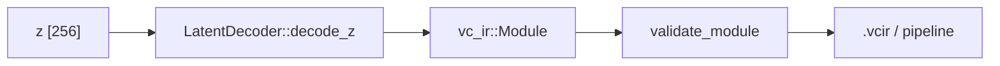
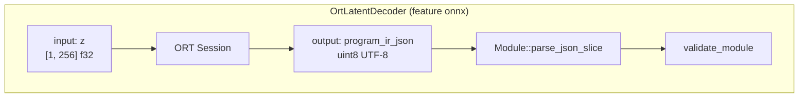

# vc-bridge

**Latent → Program IR:** maps `z` (`f32`, len **256**) to `vc_ir::Module`. Fail-closed stubs, golden CI decoder, optional **ONNX Runtime** (`OrtLatentDecoder`).



## Decoders

| Implementation | Behavior |
|----------------|----------|
| `StubLatentDecoder` | Length check → error (default until model wired) |
| `GoldenLatentDecoder` | Valid add-two-i32 IR (CI / demos) |
| `OrtLatentDecoder` (`onnx`) | ONNX → UTF‑8 `program_ir_json` → parse + validate |



Frozen names: `DECODER_ONNX_INPUT_Z`, `DECODER_ONNX_OUTPUT_IR_JSON` — see [DECODER_ROADMAP.md](../../docs/DECODER_ROADMAP.md).

## Training `z` (v0)

**Do not invent `z` in the training repo ad hoc.** Use [Z_BUILD.md](../../docs/Z_BUILD.md) (`build_z(program_id)` in [`scripts/gen_training_rows.py`](../../scripts/gen_training_rows.py)).

| Item | Contract |
|------|----------|
| `EMBEDDING_DIM` | 256 |
| Dtype | `f32` |
| JSON for CLI | `[…]` or `{"z":[…]}` |

## Features

| Feature | Default | Meaning |
|---------|---------|---------|
| *(none)* | yes | Stub + golden only |
| `onnx` | no | `ort` + `OrtLatentDecoder`; CI fixtures under `benchmarks/fixtures/` |

## CLI wiring

```bash
cargo run -p vc-cli -- decode-z -z benchmarks/fixtures/z_zeros.json \
  -o /tmp/out.vcir --decoder golden

cargo run -p vc-cli --features onnx -- decode-z \
  -z benchmarks/fixtures/z_zeros.json -o /tmp/out.vcir \
  --decoder onnx --onnx-model benchmarks/fixtures/decoder_identity_z.onnx
```

## Tests

```bash
cargo test -p vc-bridge
cargo test -p vc-bridge --features onnx
```

## Docs

- [DECODER_ROADMAP.md](../../docs/DECODER_ROADMAP.md)
- [Z_CONTRACT.md](../../docs/Z_CONTRACT.md)
- [TRAINING_DATA.md](../../docs/TRAINING_DATA.md)
