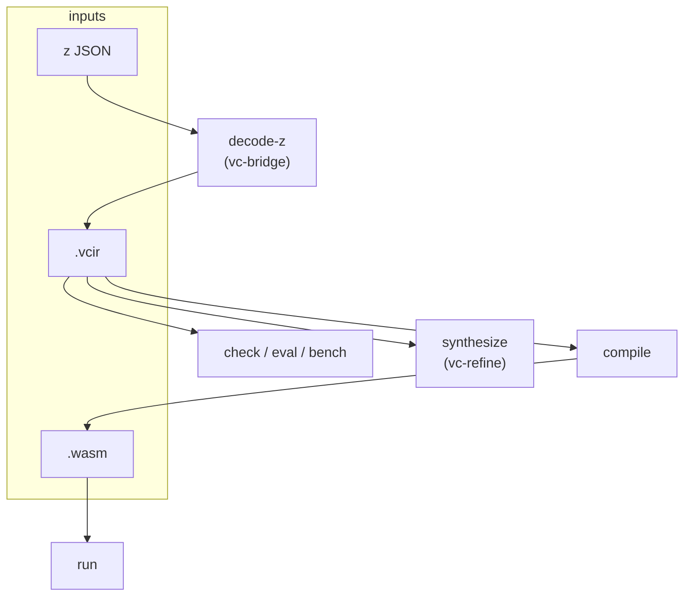
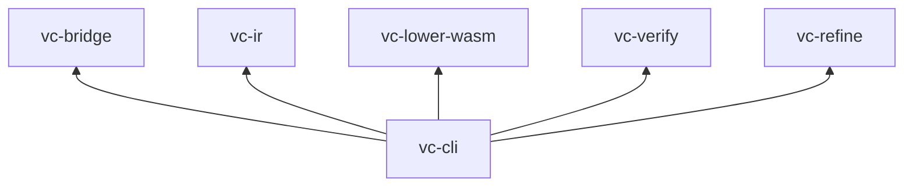

# vc-cli (`vectorc`)

Operator binary for the full **latent → IR → Wasm → verify** pipeline. Logs on **stderr**; scriptable stdout for `digest`, `inspect --json`, `eval --json`, scoreboards.



## Commands

| Command | Purpose |
|---------|---------|
| `decode-z` | `z` → `.vcir` (+ optional Wasm); `--decoder stub\|golden\|onnx` |
| `compile` | `.vcir` → `.wasm`; `--print-digest` |
| `digest` | SHA‑256 hex of any bounded file |
| `inspect` | Human summary or `--json` metrics |
| `check` | One manifest/spec, in-process |
| `eval` | VectorBench suite; `--task` for training oracle |
| `bench` | Manifest path → reference `.vcir` under `benchmarks/` |
| `run` | Wasm + fuel; optional `--isolate` subprocess |
| `synthesize` | Spec-driven IR search |

## Training oracle (typical)

```bash
cargo run -p vc-cli --quiet -- eval \
  -i /tmp/decoded.vcir \
  --suite benchmarks/vectorbench_v0/suite.json \
  --task add_i32 \
  --json
```

Wrappers: [`scripts/training-oracle.sh`](../../scripts/training-oracle.sh), [`scripts/vectorbench_oracle.py`](../../scripts/vectorbench_oracle.py).

## Features

| Feature | Enables |
|---------|---------|
| default | stub / golden decode |
| `onnx` | `--decoder onnx --onnx-model PATH` |

## Workspace graph



## Tests

```bash
cargo test -p vc-cli
cargo test -p vc-cli --features onnx --test onnx_fixture_decode
```

## Docs

- [DEVELOPMENT.md](../../docs/DEVELOPMENT.md)
- [TRAINING_ON_MAC.md](../../docs/TRAINING_ON_MAC.md)
- [PREFLIGHT_BEFORE_TRAINING.md](../../docs/PREFLIGHT_BEFORE_TRAINING.md)
