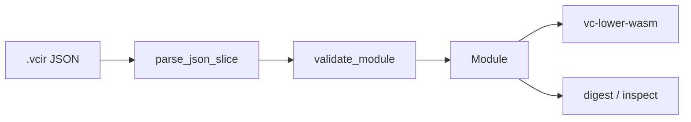
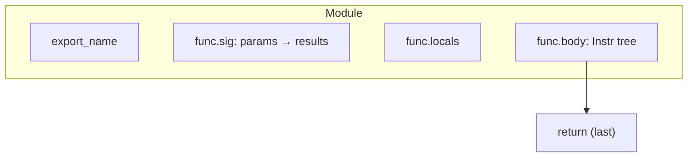

# vc-ir

**Program IR v2** — the semantic contract between latent decoders, lowering, and trust tooling. Parses JSON (`.vcir`), validates stack discipline, exports tier‑1 size caps. **No Wasm dependency.**



## Role in the pipeline

| Phase | This crate |
|-------|------------|
| Authority | **What programs mean** (types, control flow, limits) |
| Not responsible for | Execution, lowering, latent `z`, ONNX |

Decoders and tools must emit IR that passes `validate_module`. JSON Schema ([`schemas/program_ir_v2.schema.json`](../../schemas/program_ir_v2.schema.json)) describes shape only; **Rust validation is authoritative**.

## Surface

| Item | Purpose |
|------|---------|
| `Module`, `Func`, `Instr`, `ValType` | AST (`ast.rs`) |
| `validate_module` | Stack typing, control merge, caps |
| `PROGRAM_IR_VERSION` | Must be `2` |
| `instr_tree_node_count` / `max_control_nesting_depth` | Metrics for `vectorc inspect` |

### Tier‑1 caps (`limits.rs`)

| Constant | Value |
|----------|------:|
| `MAX_BODY_INSTRS` | 4096 tree nodes |
| `MAX_CONTROL_DEPTH` | 32 |
| `MAX_PARAMS` | 16 |
| `MAX_DECLARED_LOCALS` | 64 |
| `MAX_EXPORT_NAME_LEN` | 128 bytes (UTF‑8) |

## IR shape (v2)

One exported function; Wasm‑aligned scalars (`i32` / `i64` / `f32` / `f64`); structured `block` / `if_else`; body ends with `return` (not nested in control).



## Tests

```bash
cargo test -p vc-ir
```

Proptest and boundary tests live under `tests/` and `src/validate.rs`.

## Docs

- [IR_VERSIONING.md](../../docs/IR_VERSIONING.md)
- [TRUST_AND_CANONICAL_ARTIFACTS.md](../../docs/TRUST_AND_CANONICAL_ARTIFACTS.md)
- [ARCHITECTURE.md](../../docs/ARCHITECTURE.md)
