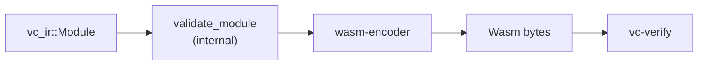
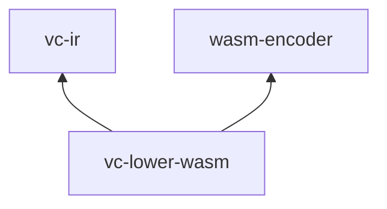

# vc-lower-wasm

**Lowering only:** validated Program IR v2 → a minimal **Wasm MVP** module (`wasm-encoder`). No runtime, no optimizer, no latent input.



## Role in the pipeline

| In | Out |
|----|-----|
| `Module` (already valid or validated here) | Single-function Wasm: one type, one export, one code section |

Lowering is a **1:1 opcode map** — auditable, predictable. First-party modules are import-free and match [`WasmPolicy::default`](../vc-verify/src/lib.rs) in `vc-verify`.

## API

```rust
let wasm = vc_lower_wasm::lower_module(&module)?;
```

`lower_module` calls `vc_ir::validate_module` first, then emits:

- Type section (function signature from IR)
- Single function + export (`module.export_name`)
- Locals grouped by type; control via `block` / `if` / `else` / `end`

## Dependencies



## Tests

End-to-end tests lower fixtures under `benchmarks/programs/` and invoke via `vc-verify`:

```bash
cargo test -p vc-lower-wasm
```

Golden Wasm policy checks: `tests/golden_wasm_policy.rs`.

## Docs

- [ARCHITECTURE.md](../../docs/ARCHITECTURE.md) — Wasm-first rationale
- [SECURITY.md](../../docs/SECURITY.md) — containment at run time
