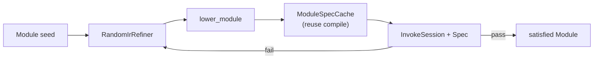
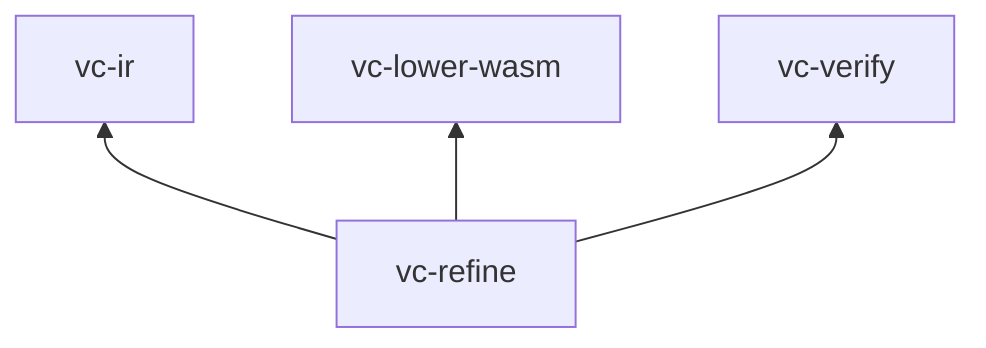

# vc-refine

**Verifier-guided search** over Program IR: mutate candidates, lower to Wasm, run behavioral **spec** cases under fuel. Powers `vectorc synthesize`.



## Role in the pipeline

| In | Out |
|----|-----|
| `Module` + `Spec` (I/O cases) | `Module` that passes all cases within step budget |

This is **search**, not latent decoding. Training decoders use **`vectorc eval`** / VectorBench; synthesis uses **spec satisfaction** here.

## Core types

| Type | Role |
|------|------|
| `Spec` / `SpecCase` | `args: Vec<i32>`, `expect_i32` |
| `ProgramRefiner` | `refine(initial, spec, fuel, max_steps)` |
| `RandomIrRefiner` | Random mutations + validate + cached Wasm runs |

`module_satisfies_spec` lowers once per candidate (with **invoke session cache** when Wasm bytes unchanged).

## Spec JSON

Same case shape as benchmark manifests:

```json
{ "cases": [ { "args": [40, 2], "expect_i32": 42 } ] }
```

## Dependencies



## Tests

```bash
cargo test -p vc-refine
```

Fixture: refine wrong `sub` → `add` against `benchmarks/manifests/add.json` cases.

## Docs

- [ARCHITECTURE.md](../../docs/ARCHITECTURE.md) — extension points
- [VECTORBENCH_V0.md](../../docs/VECTORBENCH_V0.md) — eval vs synthesis
