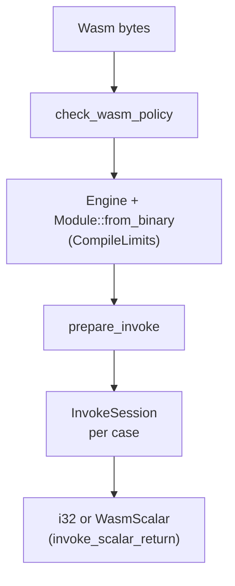

# vc-verify

**Sandboxed Wasm execution** for VectorCompiler: policy scan → compile (Wasmtime) → fuel‑metered invoke. Knows **Wasm bytes only**, not Program IR.



## Role in the pipeline

| Layer | Coverage |
|-------|----------|
| **Compile** | Size cap, static policy, optional compile wall-clock |
| **Invoke** | Fuel + optional cooperative wall-clock (`epoch`) |
| **Not covered** | Cranelift work inside compile timeout beyond returning error; host FS trust |

## Limits

| Constant / type | Meaning |
|-----------------|--------|
| `MAX_WASM_BYTES` | 16 MiB max module size |
| `CompileLimits::max_wall_ms` | Default 30s compile budget (`DEFAULT_COMPILE_WALL_MS`) |
| `Limits::fuel` | Guest execution steps (Wasmtime fuel) |
| `Limits::max_wall_ms` | Guest cooperative deadline |

## Policy (`WasmPolicy::default`)

Rejects before load: **imports**, **memory**, **tables**, **start**, **globals**, **data**, component model. Custom policy is for embeddings that wire host imports explicitly.

## API patterns

**One-shot** (CLI `run`, sporadic checks):

```rust
vc_verify::invoke_i32_return(&wasm, "run", &args, limits)?;
```

**Hot loop** (bench, `vectorc check`, `vc-refine`):

```rust
let compiled = CompiledModule::new(&wasm)?;
let mut session = compiled.prepare_invoke("run")?;
for case in cases {
    let got = session.invoke_i32_return(&case.args, limits)?;
}
```

## Tests

```bash
cargo test -p vc-verify
```

Policy rejection, fuel, wall-clock, compile timeout, and session reuse: `tests/invoke_checks.rs`.

## Docs

- [SECURITY.md](../../docs/SECURITY.md)
- [ADVERSARIAL_AUDIT.md](../../docs/ADVERSARIAL_AUDIT.md)
