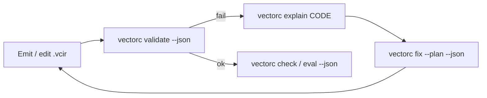

# Agent compiler interface

Structured compiler output for ML agents and automation—aligned with the **latent → validated IR → Wasm** pipeline, inspired by agent-first toolchains such as [zerolang](https://github.com/vercel-labs/zerolang).

Human prose remains on **stderr** (`RUST_LOG`); **stdout** is for machine contracts when `--json` is set.

---

## Commands

| Command | Role |
|---------|------|
| `vectorc validate -i FILE.vcir --json` | `validate_module` + `VCIR_*` diagnostics |
| `vectorc parse -i FILE.vcir --json` | Parse summary (syntax only) |
| `vectorc explain VCIR_STK001 --json` | Stable code catalog entry |
| `vectorc explain --all --json` | All validation codes |
| `vectorc fix -i FILE.vcir --plan --json` | Typed repair plan (no file edits) |
| `vectorc skills list` / `skills get language` | Version-matched IR / limits / decoder docs |
| `vectorc inspect --json` | Metrics after successful validation |
| `vectorc check --json` | Behavioral oracle (parse → validate → compile → run) |
| `vectorc agent-repair --json` | Bounded check → fix-plan → optional `synthesize` |
| `vectorc eval --json` | VectorBench metrics (`execute_rate`, …) |

**Naming:** `validate` = static IR typing. `check` = behavioral spec / manifest execution.

---

## Diagnostic shape

```json
{
  "code": "VCIR_CTL001",
  "message": "`return` is only allowed as the final function instruction",
  "expected": "return only as final top-level instruction",
  "actual": "return inside block/if_else",
  "severity": "error",
  "repair": {
    "id": "move-return-to-function-end",
    "safety": "safe",
    "summary": "Only the final top-level instruction may be return; use block values instead."
  }
}
```

Codes are defined in `vc_ir::diagnostics` and listed in [`skills/diagnostics.md`](../skills/diagnostics.md).

---

## Repair loop (recommended)



For search-based repair inside the repo, use `vectorc synthesize` (`vc-refine`) or the bounded loop:

```bash
vectorc agent-repair -i prog.vcir -m benchmarks/manifests/add.json --max-steps 3 --synthesize --json
# or: --spec path/to/spec.json  (JSON: { "cases": [ { "args": [...], "expect_i32": N }, ... ] })
```

`check --json` may include structured counterexamples:

```json
{
  "ok": false,
  "validation_code": "VCIR_CTL001",
  "failed_case_index": 0,
  "failed_case": { "args": [1, 2], "expect_i32": 3, "got_i32": 99 }
}
```

---

## Skills

Bundled at compile time from [`skills/`](../skills/):

| Skill | Contents |
|-------|----------|
| `language` | IR v2 shape and workflow |
| `diagnostics` | `VCIR_*` table |
| `limits` | Tier-1 caps |
| `decoder` | `z` + ONNX contract |

---

## Conformance fixture

Invalid IR for testing diagnostics:

`benchmarks/conformance/invalid/return_inside_block.vcir` → `VCIR_CTL001`.

```bash
vectorc validate -i benchmarks/conformance/invalid/return_inside_block.vcir --json
vectorc fix -i benchmarks/conformance/invalid/return_inside_block.vcir --plan --json
```

---

## Related docs

- [ARCHITECTURE.md](ARCHITECTURE.md)
- [DECODER_ROADMAP.md](DECODER_ROADMAP.md)
- [DEBUGGING_DECODE.md](DEBUGGING_DECODE.md)
