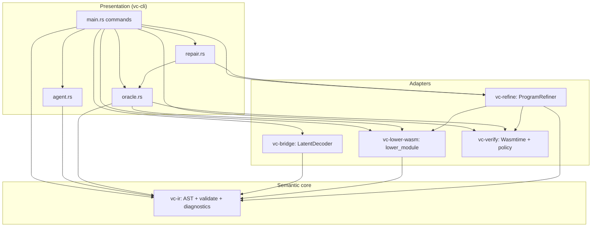

# Architectural audit

Independent review of VectorCompiler’s crate boundaries, dependency graph, extension points, and structural risks. Complements [ARCHITECTURE.md](ARCHITECTURE.md) (descriptive) and [ADVERSARIAL_AUDIT.md](ADVERSARIAL_AUDIT.md) (threat model).

**Verdict:** The design is **strong and appropriate for a research compiler v0** — clear semantic waist, acyclic layers, and testable seams. It is **not yet** a fully polished “platform” architecture (some duplication and a large CLI binary remain). Score: **8/10** for stated goals; **6/10** if judged as a general-purpose compiler framework today.

---

## Design goals (explicit)

| Goal | Architectural choice |
|------|----------------------|
| Verifiable bridge from latent → machine | **Program IR v2** as the only mandatory waist |
| Behavior over syntax | Oracle = validate → lower → Wasm **execute** under fuel |
| Portability | Wasm MVP, import-free first-party modules |
| Agent/automation | Stable `VCIR_*` diagnostics + JSON stdout contracts |
| Training honesty | External PyTorch; in-repo **oracle only** |

These goals are **coherent** — the crate split follows them, not the reverse.

---

## Layered model (actual vs ideal)



**Ideal layer rule:** presentation never embeds Wasm lowering logic except through shared pipeline code. **Today:** `oracle.rs` is that pipeline; `bench` should call it (unified in this audit’s follow-up).

---

## What is very well designed

### 1. Semantic waist (`vc-ir`)

- **Single exported function** IR keeps validation tractable.
- **`validate_module` before any lowering** — lowerer re-validates (defense in depth).
- **`diagnostics` module** separates stable agent codes from internal `ValidationError` — good for API evolution.
- **No Wasm in `vc-ir`** — correct dependency direction.

### 2. Acyclic dependency graph

```
vc-ir          (root)
vc-lower-wasm  → vc-ir
vc-verify      → (wasmtime only)
vc-bridge      → vc-ir
vc-refine      → vc-ir, vc-lower-wasm, vc-verify
vc-cli         → all of the above
```

No cycles. `vc-verify` does not depend on IR — **execution is intentionally ignorant of source language**.

### 3. Extension points (real, not hypothetical)

| Phase | Extension | Location |
|-------|-----------|----------|
| Decode | `LatentDecoder` trait | `vc-bridge` |
| Lower | `lower_module` (future `trait Lowerer`) | `vc-lower-wasm` |
| Execute | `CompiledModule` + `Limits` | `vc-verify` |
| Search | `ProgramRefiner` trait | `vc-refine` |

`ModuleSpecCache` in `vc-refine` shows **performance-aware design**: reuse Wasm compile + `InvokeSession` when lowered bytes unchanged.

### 4. Fail-closed boundaries

- Stub decoder errors instead of emitting garbage IR.
- ONNX path: shape check → UTF-8 cap → `validate_module`.
- Wasm policy scan before `Module::from_binary`.
- Agent `fix --plan` does not mutate files (plans ≠ patches).

### 5. Contract-first artifacts

- JSON Schema for IR, manifests, datasets (`schemas/`).
- VectorBench suite as **data**, not code.
- Version pins: `program_ir_version`, `schema_version`, `rust-version`.

### 6. Testing seams match layers

| Layer | Tests |
|-------|--------|
| IR | Unit + proptest |
| Lower | E2E + golden Wasm policy |
| Verify | Policy + fuel + wall-clock |
| Refine | Integration from wrong IR → spec |
| CLI | Subprocess smokes |

---

## Architectural smells (ranked)

### S1 — `vc-cli` concentration (medium)

`main.rs` is ~1.4k lines: path resolution, bench, eval, run/isolate, decode-z, synthesize, manifests. Submodules (`agent`, `oracle`, `repair`) help but **presentation + orchestration are not fully separated**.

**Recommendation (when growth continues):**

- `vc-pipeline` crate: `evaluate_module(path|bytes, cases, limits) -> CheckSummary`
- Thin `main.rs` dispatch only
- Optional `vc-agent` if agent surface grows beyond ~500 LOC

**Not urgent** for v0 if oracle stays the single pipeline entry.

### S2 — Duplicate I/O case types (low)

`oracle::BenchCase` ≡ `vc_refine::SpecCase`. Manifest JSON is the same shape in three places (oracle, main `BenchManifest`, refine `Spec`).

**Recommendation:** Re-export `SpecCase` from `vc-refine` (or move to `vc-ir::spec` if IR crate should stay agent-agnostic). CLI deserializes into shared type.

### S3 — `bench` vs `check`/`eval` divergence (medium, **fixed**)

Historically `bench` inlined lower+invoke; `check`/`eval` used `oracle::evaluate_vcir_path`. That violated **one oracle, one truth**.

**Fix:** `bench` delegates to `evaluate_vcir_path` on the manifest’s resolved `program_path`.

### S4 — No `trait Lowerer` yet (low)

Only `lower_module` function. Fine for one backend; document trait when adding a second backend.

### S5 — Diagnostics live in `vc-ir` (acceptable)

Agent metadata (`FixPlan`, `explain_code`) in the IR crate couples “language” to “agent UX.” Alternative: `vc-diagnostics` crate. **Current choice is pragmatic** for a small workspace.

### S6 — Compile-time cost outside guest fuel (documented)

Cranelift compile not fuel-metered; `CompileLimits` + worker cap mitigate. Architectural **honesty** in `vc-verify` docs is correct; not a design bug.

---

## Invariants (should never break)

1. **Every path to Wasm execution** runs `validate_module` (directly or via `lower_module`).
2. **First-party lowered Wasm** has no imports/memory/tables (policy + lowerer discipline).
3. **Training metrics** come from in-process or subprocess `eval`/`check`, not from parse success alone.
4. **Agent codes** remain stable per `program_ir_version` bump policy ([IR_VERSIONING.md](IR_VERSIONING.md)).
5. **Untrusted paths** use `read_bounded` + canonicalize for suite/bench manifests.

---

## Comparison to common patterns

| Pattern | Fit |
|---------|-----|
| **Compiler pipeline** (lex/parse/validate/codegen) | Yes — IR → lower → Wasm |
| **Hexagonal / ports** | Partial — traits at decode/refine; CLI is thick adapter |
| **CEGIS** | Yes — `vc-refine` + `agent-repair` counterexamples |
| **LLVM as waist** | Deliberately rejected — Wasm + small IR |
| **Microservices** | No — monorepo workspace is correct |

---

## Evolution roadmap (architecture)

| Phase | Change |
|-------|--------|
| **Now** | Single oracle module; unified `bench` |
| **v0.2** | Shared `SpecCase`; `vc-pipeline` extract if CLI > 2k LOC |
| **v1** | `trait Lowerer`; optional `vc-agent` crate |
| **Scale** | VectorBench as plugin registry; decoder registry behind `LatentDecoder` |

---

## Summary

VectorCompiler’s architecture **matches its thesis**: a narrow, validated IR waist, a portable Wasm object file, and an execution oracle that grounds ML training and agents. Crate boundaries are **mostly right**; the main gap was **orchestration duplication in the CLI**, not confusion in the semantic core.

For “very well designed” in the **research-infrastructure** sense: **yes**, with the fixes and discipline above. For **production compiler framework**: extract pipeline + shared spec types before advertising extension to third-party backends.

See also: [CODEBASE_AUDIT_2026-05.md](CODEBASE_AUDIT_2026-05.md), [CONDITIONS_FOR_OBSOLESCENCE.md](CONDITIONS_FOR_OBSOLESCENCE.md).
