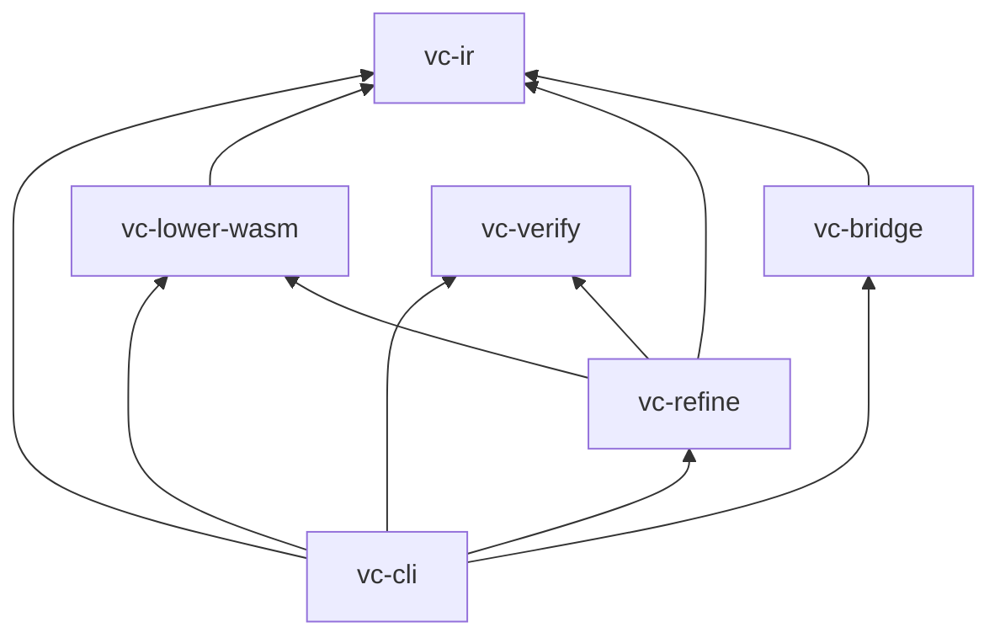

# Architecture

This document describes how VectorCompiler is split into crates, where responsibility stops, and why WebAssembly sits at the center of the execution story.

---

## Crate map

| Crate | Responsibility |
|-------|----------------|
| **`vc-ir`** | **Program IR v2:** serde-friendly AST (`Module`, `Func`, `Instr`), JSON parsing, and a **stack validator** that enforces Wasm-like typing and structured control (`block` / `if_else`) before any bytes are emitted. |
| **`vc-lower-wasm`** | **Lowering only:** translates a validated `vc_ir::Module` into a Wasm binary via `wasm-encoder` (types, single function, export, code). No runtime, no I/O. |
| **`vc-verify`** | **Execution sandbox (host-side):** Wasmtime with **fuel** + **epoch interruption**, **`WasmPolicy`** scan (deny imports/memory/tables/start by default), **`&[]` imports**, single exported **`(i32…)→i32`** call. |
| **`vc-refine`** | **Verifier-guided IR search:** behavioral **`Spec`** over I/O cases; **`RandomIrRefiner`** mutates IR and checks candidates via **`vc-verify`** (used by **`vectorc synthesize`**). |
| **`vc-bridge`** | **Latent → IR:** `LatentDecoder::decode_z`; **`StubLatentDecoder`**, **`GoldenLatentDecoder`**; optional **`onnx`** → **`OrtLatentDecoder`** (`z` + **`program_ir_json`** → validated `Module`). |
| **`vc-cli`** | **Operator UX:** **`decode-z`**, **`compile`** / **`digest`** / **`inspect`**, agent surface (**`validate`**, **`parse`**, **`explain`**, **`fix`**, **`skills`**), **`check`** / **`eval`** (in-process oracle in `oracle.rs`), **`agent-repair`** (`repair.rs`), **`run`**, **`bench`**, **`synthesize`**. Binary name **`vectorc`**. |

---

## Boundaries (what depends on what)

- **`vc-ir` has no Wasm dependency.** It is the semantic contract: if it validates, lowering assumes a well-typed stack program.
- **`vc-lower-wasm` depends only on `vc-ir` and `wasm-encoder`.** It never executes code.
- **`vc-verify` depends on Wasmtime** but knows nothing about Program IR—only Wasm bytes and numeric limits.
- **`vc-bridge` depends on `vc-ir`** so decoders emit the same `Module` type the rest of the pipeline accepts. **`vectorc decode-z`** is the CLI integration point (stub / golden / ONNX). Per-crate detail: [`crates/vc-bridge/README.md`](../crates/vc-bridge/README.md); export/training contracts: **`docs/DECODER_ROADMAP.md`**.

---

## Extension points: Decoder, Lowerer, Executor

The codebase uses **clear phases** that map cleanly to pluggable implementations—even where today some phases are functions rather than traits.

### Decoder (`LatentDecoder`)

Defined in `vc-bridge`:

- **`LatentDecoder`** — `fn decode_z(&self, z: &[f32]) -> Result<Module>`
- **`StubLatentDecoder`** — enforces `z.len() == EMBEDDING_DIM` (256) then errors with a message pointing to training / ONNX.

This is the **insertion point** for learned models, ONNX sessions, or hand-written encoders: anything that can emit a `vc_ir::Module` can participate without touching the lowerer.

### Lowerer (`lower_module`)

`vc-lower-wasm::lower_module` is the **Lowering** step: IR that passes `validate_module` becomes a self-contained Wasm module with a named export. The implementation is intentionally boring (explicit instruction mapping, no optimizer) to keep semantics auditable.

*Pattern:* if you add alternate back ends (e.g., LLVM, another Wasm dialect), mirror this boundary: **validated IR in, executable artifact out**, with validation reused or duplicated under a shared trait as the workspace grows.

### Executor (`invoke_i32_return`)

`vc-verify::invoke_i32_return` is the **Execution** step: Wasmtime engine (**fuel** + **epoch interruption**), **`WasmPolicy`** preflight on Wasm bytes, arity and type checks for `i32` params and a single `i32` result, then **`func.call`**. Optional **`Limits::max_wall_ms`** maps to cooperative epoch preemption (watchdog **`increment_epoch`**); traps **`Interrupt`** are surfaced as **`wall-clock timeout exceeded`** when applicable.

*Pattern:* swapping engines means preserving **`Limits`** semantics (fuel + optional wall-clock) and keeping the host ABI narrow.

---

## Wasm-first rationale

### Portability

Wasm is the **portable object file** for VectorCompiler: the same lowered module can be shipped to macOS arm64, Intel macOS, Linux RISC-V, browsers (with a different embedding), or serverless Wasm hosts—without re-deriving native codegen for each latent model revision.

### Auditability and containment

Program IR v2 is small enough to **diff** in code review. Wasm emitted today is import-free and single-export, which sharply reduces “host escape” compared to arbitrary native shared libraries.

### Determinism (as configured here)

Wasmtime is configured with **fuel metering** (`consume_fuel`, `set_fuel`). That is not a full reproducibility proof, but it gives a **hard cap** on abstract execution steps for benchmarking and untrusted inputs (see [SECURITY.md](SECURITY.md)).

### Alignment with future decoders

A decoder that outputs **only** what `vc_ir` accepts cannot request syscalls the lowerer does not encode—the remaining risk shifts to **host execution policy** (fuel, memory, future WASI decisions), not to ad-hoc FFI sprawl inside the IR.

---

## Program IR v2 snapshot

- One exported function (`export_name`), Wasm-style locals after parameters.
- Parameters, locals, and single return: **`i32`**, **`i64`**, **`f32`**, **`f64`** (Wasm scalar subset).
- Instructions: integer/float constants and binops, **`i32_eq`**, **`i32_eqz`**, **`i32_trunc_f32_s`**, **`f32_convert_i32_s`**, **`f32_gt`**, `drop`, `local_get` / `local_set`, structured **`block`** / **`if_else`**, and a single trailing **`return`** (never nested inside control).
- Validator checks structured stack discipline (including matching branch stacks), instruction tree size / nesting depth, `program_ir_version == 2`, and non-empty export name.

JSON Schema: [`schemas/program_ir_v2.schema.json`](../schemas/program_ir_v2.schema.json). Authoritative Rust types: `vc_ir::ast` and `validate_module`.

---

## Testing seams

- **`vc-ir`:** unit tests on the validator (e.g., accept/reject control flow).
- **`vc-lower-wasm`:** end-to-end tests load `.vcir` fixtures (including float / `if_else`), lower, invoke via `vc-verify`.
- **`vc-cli`:** exercised manually via `cargo run -p vc-cli -- …` and integration tests in `crates/vc-cli/tests/`.

This layering keeps **IR correctness**, **binary shape**, and **runtime policy** independently testable.

---

## Architectural invariants

Independent audit: [ARCHITECTURAL_AUDIT.md](ARCHITECTURAL_AUDIT.md). Rules that should hold across refactors:

1. **Validated IR before Wasm** — `validate_module` on every execution path (directly or inside `lower_module`).
2. **Single behavioral oracle** — `check`, `eval`, and `bench` share `vc-cli`’s `oracle::evaluate_vcir_path` (parse → validate → lower → invoke).
3. **Execution ignorance of IR** — `vc-verify` only sees Wasm bytes + policy + limits.
4. **Decoder fail-closed** — `LatentDecoder` implementations must not emit unvalidated `Module`s (ONNX path validates after decode).
5. **Agent plans are not edits** — `fix --plan` and repair reports are hints; file mutation is explicit (`synthesize`, `agent-repair -o`, or external tools).
