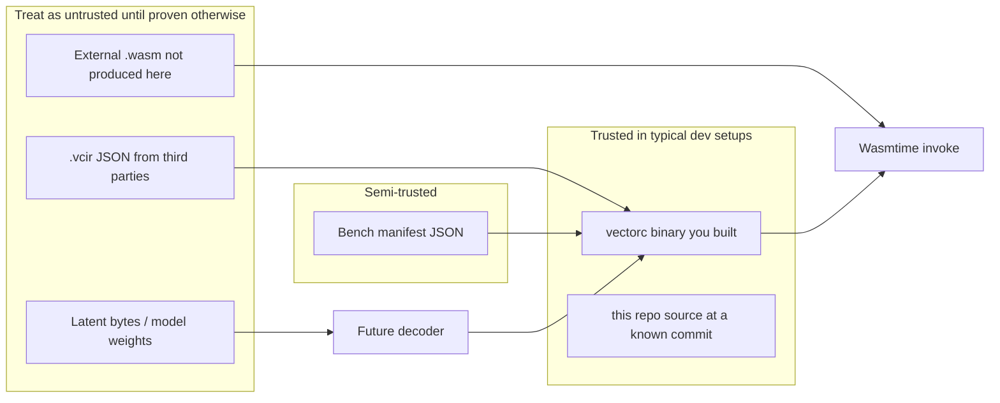

# Security

VectorCompiler is designed around **small, reviewable programs** and **host-controlled execution**. This document is a **threat model sketch** for operators who compile Program IR, run generated Wasm, or integrate latent decoders in the future—not a formal proof.

---

## Assets and goals

| Asset | Goal |
|-------|------|
| **Operator host** | Running `vectorc` or embedding `vc-verify` must not grant arbitrary code execution **beyond** what you explicitly allow in the Wasm runtime. |
| **Generated Wasm** | Modules should be **import-minimal** so capability sprawl is visible in review. |
| **Program IR** | Inputs should be **validated** before lowering so malformed or type-unsafe programs fail early. |
| **Supply chain** | Dependencies (Wasmtime, `wasm-encoder`, future ONNX stacks) must be **pinned and audited** like any Rust project. |

Non-goals for v1: cryptographically proving equivalence between a latent vector and the emitted IR; full side-channel resistance for the Wasm engine itself.

---

## Trust boundaries

1. **Program IR files** (`.vcir`) should be considered **untrusted input** unless you authored them. The `vc-ir` validator reduces crash/UB risk in the **compiler**, not malice in **logic** (e.g., a “correct” program that burns fuel).
2. **`run` with arbitrary Wasm** is **untrusted binary execution** inside the Wasm sandbox **as configured**—see *Execution threats* below.
3. **Bench manifests** reference paths; treat manifests from others like code: they can point at programs you did not expect if you run them from a shared directory.

---

## Execution threats (Wasmtime embedding)

### Wasm bytecode policy (`WasmPolicy`)

Before Wasmtime loads a module, **`vc-verify`** scans the Wasm bytes with **`wasmparser`** and applies **`WasmPolicy`** (`check_wasm_policy`).

**`WasmPolicy::default()`** (used by **`CompiledModule::new`**) is **deny-by-default** for:

- **imports** — modules must not declare imports.
- **linear memories** — no memory section (guest RAM changes the threat model).
- **tables** — no table section (indirect call / funcref surface).
- **`start` section** — no start function (implicit execution before an explicit host `call`).
- **WebAssembly components** — **component encoding** and **component-model sections** are rejected (only flat **core** modules).

Use **`CompiledModule::new_with_policy`** when an embedding intentionally opts into imports, memory, or tables.

**Note:** In the current implementation, **globals, tags, element segments, data segments, component-model sections, nested modules, and any non-`Module` encoding** are **always** rejected by `check_wasm_policy` regardless of `WasmPolicy` field values — only imports/memory/tables are toggleable via `allow_*`.

### Default posture in `vc-verify`

`invoke_i32_return` today:

- Builds a Wasmtime **`Engine`** with **`consume_fuel(true)`** and **`epoch_interruption(true)`** so wall-clock limits can preempt guest code cooperatively.
- Sets **fuel** on each fresh **`Store`** (`Limits { fuel, max_wall_ms }`).
- Sets an **epoch deadline** each invocation: effectively “far ahead” when **`max_wall_ms`** is `None`, or **one epoch tick** ahead when a wall-clock budget is set (watchdog calls **`Engine::increment_epoch`** after the deadline unless the call finished first).
- Runs **`check_wasm_policy`** before **`Module::from_binary`**, then instantiates with **`&[]`** imports.

There is **no WASI**, **no filesystem**, **no sockets**, and **no clocks** wired in—**by default you get a numeric compute island** limited by fuel. Under **`WasmPolicy::default()`**, guests **cannot** declare linear memory at all; relaxing policy is an explicit choice.

### Wall-clock limits (`max_wall_ms`)

When **`Limits::max_wall_ms`** is `Some`, **`vc-verify`** arms a short epoch deadline and starts a **sleeping watchdog** thread that calls **`increment_epoch`** after the interval **unless** the invocation has already completed (so completed calls do not bump the engine epoch). Guest preemption is **cooperative** (depends on Wasmtime’s epoch check sites); combine with **strict fuel** for untrusted code.

**Cranelift compile** uses an optional host wall-clock cap ([`CompileLimits::max_wall_ms`]); on timeout the caller fails immediately but a **bounded** pool of orphan compile threads (max 8 globally) may still finish `Module::from_binary` work (see `compile_engine_module` in `vc-verify`).

**`Instance::new`** in [`CompiledModule::prepare_invoke`] runs on the current thread and is **outside** guest fuel and epoch wall-clock limits. For **first-party** modules emitted by this repo, instantiation cost is expected to scale with module size and stay small relative to compile; for **untrusted** Wasm within the byte cap, treat load + instantiate as host CPU work and use **`vectorc run --isolate`** or external job timeouts.

### CLI subprocess isolation (`vectorc run --isolate`)

For **untrusted** Wasm blobs you still cap with **`MAX_CLI_FILE_BYTES`** in the parent, then **`vectorc run --isolate`**:

1. **Bounded read** of the Wasm path in the parent (same cap as plain `run`).
2. **Writes a fresh temp file** and spawns **`std::env::current_exe()`** as a child with **`vectorc run …`** (same flags except **`--isolate`** is omitted), so **Cranelift compile + module load + invoke** run **in the child process**.
3. The parent enforces a **wall-clock timeout** while polling **`try_wait`**; on expiry it sends **`SIGKILL`** to the child **process group** on **Unix** (after **`setpgid` in the child**), with a fallback to **`Child::kill`**.

This does **not** replace Wasm fuel or **`vc-verify`** policy; it adds a **coarse host boundary** so pathological compile/load work cannot hang the parent beyond the isolate timeout.

**Platform note:** isolation semantics are **Unix-first** (process group kill). On non-Unix hosts, subprocess spawning and the wall-clock timeout still apply; group semantics may differ.

### Fuel limits

**Fuel** is a **soft cap on abstract execution steps**, not a wall-clock timeout. Properties:

- **Pro:** bounding infinite loops / pathological programs used in benchmarks.
- **Con:** choosing fuel too low causes **legitimate** programs to trap; choosing it too high may still allow **long** runs.
- **Con:** fuel does **not** bound **instantiation** cost or **module decode** cost at the Wasmtime layer the same way it bounds guest execution after instantiation—very large modules may still be expensive to load.

Operational guidance:

- Start from the CLI defaults (`50_000` on `run`, manifests often use `100_000`) and tune per workload.
- For **untrusted** Wasm, combine fuel with **external** watchdogs (process limits, job timeouts) and **size caps** on the Wasm blob before `Module::from_binary`.

### Memory and host traps

Modules accepted under **`WasmPolicy::default()`** do **not** declare linear memory. If you enable **`allow_memory`** for external Wasm, review **`memory.max`** and growth behavior — Wasmtime still applies engine defaults beyond this crate.

Traps (unreachable, **`OutOfFuel`**, **`Interrupt`** from epoch deadlines, etc.) surface as errors from Wasmtime; callers should treat **any trap** as **failure**, not as a numeric result.

---

## Compiler / IR threats

### Validation before lowering

`lower_module` and the CLI **re-validate** IR (`validate_module`) so you do not rely on lowering alone for safety. Validation mitigates **stack discoordination** and illegal locals; it does **not** prove liveness or intent.

### Supply chain: crates.io and tooling

Pinned versions in `Cargo.toml` / `Cargo.lock` reduce drift. For production:

- **`cargo audit`** (RustSec advisories) and **`cargo deny check licenses bans`** run in CI; mirror both in **`scripts/preflight.sh`** before training.
- Vendor or mirror dependencies if your policy requires it.
- Treat **Wasmtime updates** as security-relevant: they change sandbox mechanics and supported proposals.

### Decoder / ONNX (`vc-bridge`)

**`StubLatentDecoder`** fails closed after a length check. With **`--features onnx`**, **`OrtLatentDecoder`** loads a model path you supply, validates **`z`** shape/dtype, reads **`program_ir_json`** bytes, and runs **`validate_module`** before lowering.

- **Model files** are **executable definitions**: a malicious ONNX can drive **host code inside the inference runtime**—keep ONNX Runtime and models on the **trusted** side of your boundary or sandbox them separately.
- **Floating-point nondeterminism** can break “same z → same IR” assumptions across hardware; document tolerance or enforce deterministic modes if you rely on reproducibility.

---

## Operational checklist

- [ ] Only run `vectorc run` on Wasm you **trust** or have **reviewed** (exports, imports, memory).
- [ ] For **untrusted** Wasm, prefer **`vectorc run --isolate`** with an explicit **`--isolate-timeout-ms`** alongside fuel / **`vc-verify`** policy (see *CLI subprocess isolation*).
- [ ] Set **fuel** appropriate to worst-case **trusted** workloads; add **wall-clock** limits for untrusted guests.
- [ ] Prefer **bench**/`compile` flows that start from **known** `.vcir` files in version control.
- [ ] Monitor **Wasmtime** security advisories and keep the workspace on supported releases.
- [ ] If you enable **WASI** or custom host imports in a fork, **rewrite this document**—those features change the threat model materially.

For an adversarial walkthrough of concrete code paths (ONNX bridge, sandbox gaps), see [ADVERSARIAL_AUDIT.md](ADVERSARIAL_AUDIT.md).
